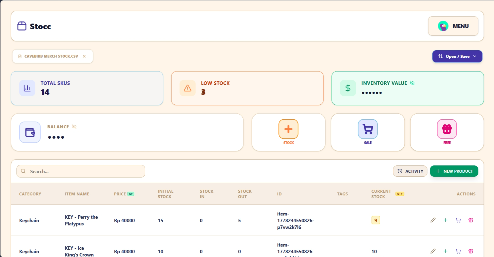
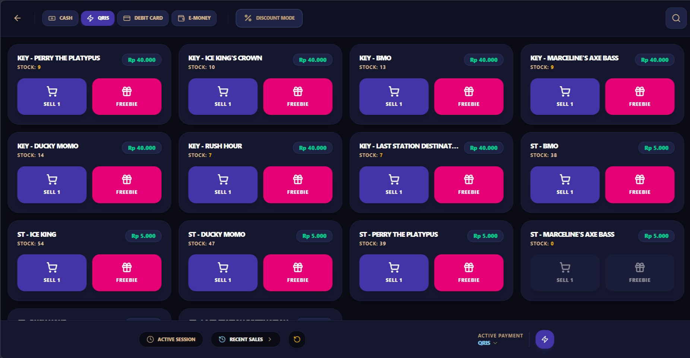
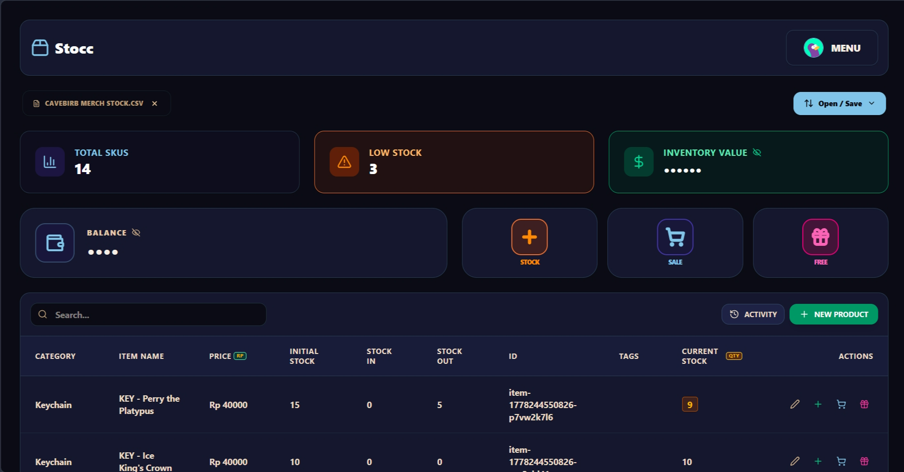
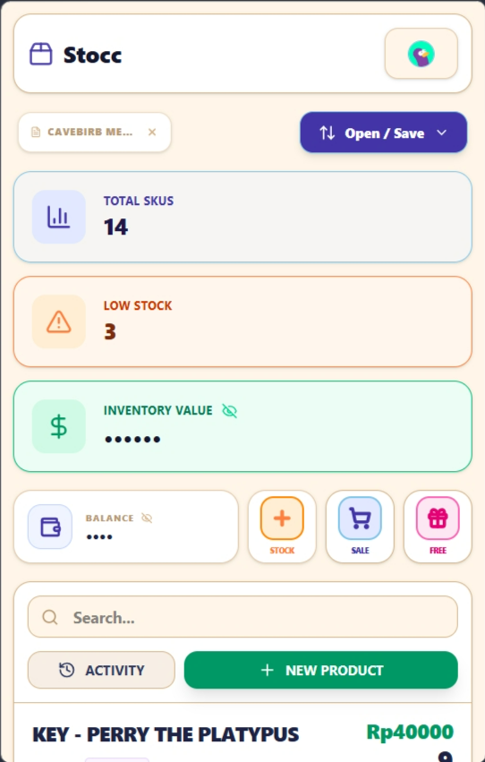
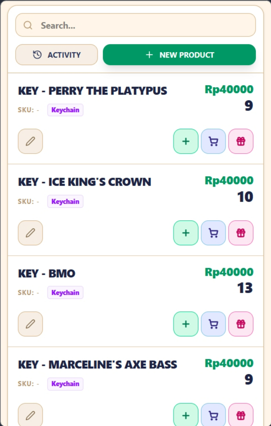

# 📦 Stocc | Smart Inventory for Artists & Convention Owners

Stocc is a high-performance, aesthetically rich inventory management application specifically designed for **artists, exhibitors, and convention business owners**. It combines the speed of a local-first application with the security of cloud synchronization via the Google Drive API, making it the perfect companion for the high-pressure environment of artist alleys and vendor halls.

**🚀 Try it live at [stocc.vercel.app](https://stocc.vercel.app)**

  

## ✨ Why Stocc?

Built with the unique needs of **Convention Exhibitors** in mind:

### ⚡ Hectic Mode
A high-density, ultra-fast UI designed for rapid-fire sales during peak convention hours. Adjust stock levels with zero friction.

  

### 🌙 Premium Dark Mode
Switch between light and dark themes seamlessly. The UI is designed to be easy on the eyes during long convention days.

  

### 📱 Mobile Ready
Use Stocc on your phone or tablet for a seamless experience at your booth.

  

    
    
  

---

## 🚀 Key Features

- **☁️ Convention-Safe Sync**: Sync your inventory CSVs and activity logs directly to your own Google Drive.
- **🛒 Artist-Focused Checkout**: A dedicated cart system that handles multi-item sales, variable payment methods, and on-the-fly discounts.
- **📶 Offline-First Reliability**: Stocc works perfectly offline and syncs your data back to the cloud as soon as you're back on the grid.
- **📊 Real-time Stats**: Track your SKUs, low-stock alerts, and total inventory value instantly.
- **🔒 Private & Secure**: Your sensitive business data stays in your local storage and your personal Google Drive.

## 📜 License

This project is proprietary and confidential. All rights reserved. Unauthorized copying or distribution is strictly prohibited. See the [LICENSE](LICENSE) file for the full legal notice.

---

Built with ❤️ for the Artist Alley community.
